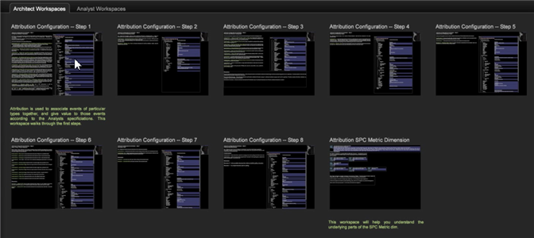

# Attribution Profile{#attribution-profile}

Using the new rules-based Attribution profile in Data Workbench, you can quickly analyze attribution events and assign responsibility leading up to a successful conversion defined by you. The Attribution profile comes complete with the information necessary for your data Architect to set up and extend its features, and includes pre-built workspaces for your Analyst to jump right in and start analyzing.

The Attribution profile allows you to gain a new perspective on the relationships between your marketing efforts and a successful customer lead generation or sales conversion. The Attribution profile helps you qualify interactions that should receive allocation of credit for realized revenue or participation downstream in the customer journey. It helps identify the impact of your marketing efforts and costs by allowing you to quickly analyze attribution events, and then assign responsibility for first or last touches or other events leading to a successful sale.

>[!IMPORTANT]
>
>The Attribution profile is configured for immediate use by users who have implemented the Adobe SC profile that uses the Analytics (SC/Insight) data feed. By default, the Marketing and Conversion events are employed as the default types of interactions evaluated in the provided rules-based models.

See [Deploying the Attribution Profile](../../../../home/c-get-started/c-attribution-profiles/c-rules-attrib/c-attrib-profile-deploy.md#concept-fbcb5800cd6a40cc901e61f3882988c0) and [Attribution Models](../../../../home/c-get-started/c-attribution-profiles/c-rules-attrib/c-attrib-models.md#concept-e209c7e86a5c4008ad6d78fdf4ea032d) for additional information.

## Architecture and Analyst Workspaces {#section-27c6aff70ba147cca6e11451e127afb4}

Within the Attribution profile, you have Architect and Analyst workspaces defined on separate tabs in the workbench.

**Architecture Workspaces**

Within the **Attribution** tab, click the **[!UICONTROL Architect Workspace]** tab to open workspaces specifically designed to set up your configuration files for basic attribution modeling.

The Architecture tab includes workspaces to step through each of the configuration files in the profile dataset folder. For example, **[!UICONTROL Attribution Configuration - Step 1]** lets you identify the Attribution values within the Transformation section of the [!DNL profile.cfg] file.

**Analyst Workspaces** Click the **[!UICONTROL Analyst]** **[!UICONTROL Workspaces]** tab to open workspaces prebuilt analysis utilizing the dimensions and metrics provided with the Attribution profile.

These workspaces are organized into four categories:

1. ** Basic Reports** expose a single model within a workspace. 
1. ** Comparative Reports** extended the analyses by presenting multiple models within a single view. 
1. **Investigation Reports** expands the reporting templates to present the attribution models in different formats. This section also introduces and exposes the position-based weighting ratios. 
1. **Pathing Reports** provide visibility into the customer's marketing journey with multiple pathing visualizations to fully explore and express the process flows and interaction paths

The Analyst tab includes workspaces pre-configured with reports. For example, **[!UICONTROL First Attribution]** lets you select from the **[!UICONTROL Campaign]** table to see the **[!UICONTROL Revenue]** attribution based on **[!UICONTROL Time]**.

