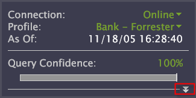

# Configure the sidebar{#configure-the-sidebar}

The sidebar provides access to regularly-used functions and preserves visualizations as you move between Workspaces.

 Administrators can customize a sidebar to make it appropriate for different user groups, then deploy the sidebar with a profile.

The sidebar is ideal to help you keep track of filters and local overrides. If you prefer not to use the sidebar, you can hide it.

## Add visualizations to the sidebar {#section-666f70a405db4f8d8eaffa567ffcac06}

1. Launch Data Workbench. 
1. In the sidebar, click **[!UICONTROL Add]** > *< **[!UICONTROL item]**>*. For example, [!DNL Selections Panel], [!DNL Filters Panel], or [!DNL Table].

   The following sidebar panels are available in the standard installation of Data Workbench. More items might be available in your specific profile:

    * **Selections Panel:** Lets you understand what selections are active in the current workspace. The [!DNL Selections Panel] updates whenever you make a new selection. You can clear selections by clicking **[!UICONTROL x]**. See [Making Selections in Visualizations](../../home/c-get-started/c-vis/c-sel-vis/c-sel-vis.md#concept-012870ec22c7476e9afbf3b8b2515746) for information about how to select data. 
    * **Filters Panel:** Makes it easy to load and apply saved filters. You can load multiple filters, and enable or disable each one independently by clicking the check box next to it. See [Filter Editors](../../home/c-get-started/c-analysis-vis/c-filter-editors/c-filter-editors.md#concept-2f343ecbed8240f18b0c1f1eccef11e3). 
    * **Local Override Panel:** This panel displays which metrics, dimensions, and filters that are present in the profile have been modified in your personal copy of the profile. This helps alert you to possible differences between the way data appears in your client and that of other users. When you save changes in a metric, dimension, or filter to the server, the override is removed from the [!DNL Local Overrides panel]. If you click an override and then click **[!UICONTROL Revert to Server]**, the local override is removed and the item reverts to the shared version. 
    * **Metric Legend:** Adds a metric legend. [!DNL Metric legends] enable you to see baseline metrics related to your profile and statistics related to the dataset (or to the current selection, if one has been made). See [Metric Legends](../../home/c-get-started/c-analysis-vis/c-legends/c-metric-leg.md#concept-e7195bc8f7844ae295bda3a88b028d5b). 
    * **Color Legend:** Adds a color legend. You can color-code visualizations by metrics, such as Conversion and Retention, and use them in almost every [!DNL Workspace]. Linking business metrics to color makes it easy to spot anomalies, exceptions, and trends. See [Color Legends](../../home/c-get-started/c-analysis-vis/c-legends/c-color-leg.md#concept-f84d51dc0d6547f981d0642fc2d01358). ** 
    * **Text Annotation:** Adds a notes panel. [!DNL Text annotations] are windows into which you can enter arbitrary text to add descriptive information or comments to a [!DNL Workspace]. See [Working with Text Annotations](../../home/c-get-started/c-analysis-vis/c-annots/c-text-annots.md#concept-55b4aa3e0c58470b8e3c9d452e12a777). 
    * **Table:** Adds a table. A table can display one or more metrics across one or more dimensions of data. See [Tables](../../home/c-get-started/c-analysis-vis/c-tables/c-tables.md#concept-c632cb8ad9724f90ac5c294d52ae667f). 
    * **Open:** Opens a saved file.

## Open a Sidebar Panel {#section-cbc8e57491854274a577d47a48c306b8}

You can open a sidebar visualization file from a saved location or from the clipboard.

1. In the sidebar, click **[!UICONTROL Add]** > **[!UICONTROL Open]**. 
1. Click **[!UICONTROL File]** to locate the [!DNL .vw] file of the panel you want to add, or click **[!UICONTROL Last Closed Window]**, which pulls the visualization from the clipboard.

   Additionally, you can click **[!UICONTROL From Clipboard]** to paste a visualization that has been copied to the clipboard. See [Copying a Sidebar Panel](../../home/c-get-started/c-config-sidebar.md#section-720ae057632a4b8dbb94412e06a370b1).

## Copying a Sidebar Panel {#section-720ae057632a4b8dbb94412e06a370b1}

1. Right-click the panel’s top border, then click **[!UICONTROL Copy]** > **[!UICONTROL Window]**. 
1. To paste the panel, click **[!UICONTROL Add]** > **[!UICONTROL Open]** > **[!UICONTROL From Clipboard]**.

## Saving a Sidebar Panel {#section-fb19936b12704fb0a4c592abb579db1d}

On an sidebar panel, right click in the title bar and click **[!UICONTROL Save]**.

Similarly, you can open a saved sidebar visualization. Data Workbench saves the visualization as a [!DNL .vw] file at the location you specify.

## Revert to the Default Sidebar {#section-4d14b8771ad747bba799876267f24831}

In the sidebar, click **[!UICONTROL Options]** > **[!UICONTROL Revert]**.

When you close Data Workbench, the system saves the current sidebar configuration in the [!DNL sidebar.vw] file in the user profile. When you open Data Workbench, the system loads the [!DNL sidebar.vw] file from the user profile, rather than a parent profile.

You can revert to a default or previously saved sidebar, which deletes the sidebar from the user profile and reloads the sidebar from the parent profile. Administrators can replace the default (parent) sidebar with a local sidebar by uploading it from the [!DNL Profile Manager].

## Customize the More Status Panel File {#section-8d502f3b59cc4331966edec05e896ce1}

System administrators can build formulas in the [!DNL More Status Panel.vw]. This places contextual words around metric and dimension values, and displays the results in the [!DNL More Status panel] in the sidebar.

To display the [!DNL More Status panel] in the sidebar, click the arrows shown in the following example.

The following procedure shows a simple example of how to create a customized status that tells you how many days are in a dataset:

1. In the [!DNL Profile Manager], click **[!UICONTROL Sidebar\]**. 

1. In the [!DNL Base_5_3*] column, make a local copy of the [!DNL More Status Panel.vw] file.

   To do so, right-click the file check mark and click **[!UICONTROL Make Local]**. 

1. Open the [!DNL More Status Panel.vw] file in the [!DNL .vw] [!DNL Editor] or in Notepad.

   

1. Complete the [!DNL Context] and [!DNL Items] fields in the [!DNL Editor]. See [Query Language Syntax](../../home/c-get-started/c-qry-lang-syntx/c-qry-lang-syntx.md#concept-15d1d3f5164a47d49468c5acb7299d9f) for guidelines about syntax. 

1. Save the file.

   The values in the preceding example result in a status formula displayed as follows:

   

