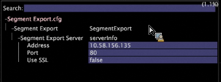

# Segment export{#segment-export}

You can easily create a Segment Export definition from the Detail Table visualization in the Data Workbench Client.

In addition, [!DNL Segment Exports] automatically combine their results to a single server, rather than producing partial results on each DPU that you must combine using an external process. You can create a segment export file, save it to the [!DNL Profile Manager], and upload the output file to a server of your choice.

**To configure the segment export server**

The [!DNL Segment Export] feature creates a single output file on the segment export server, rather than separate output files created on each DPU. The segment export server is usually configured to run on the FSU.

In the Dataset\ directory in the [!DNL Profile Manager], open the [!DNL Segment Export.cfg] in Workstation, and specify your server’s address. (Your address could be an IP or fully qualified domain name.):



This is IP of the Data Workbench server receiving the results of the segment export. This is a one-time setup. If the [!DNL Segment Export.cfg] is not present, exports do not run.

**To configure export directories**

For security purposes, executables or batch files that run after a segment export must reside in the configurable Scripts\ directory of the segment export server.

The [!DNL .part] and final output must reside in the configurable Exports directory. The command to run exists in Command and Command Arguments. Instances of the %file% in the Command Arguments will be replaced with the path of the output file.

>[!NOTE]
>
>New to Data Workbench 5.4, the \Exports folder is created automatically. Previous export directories set up before version 5.4 required an Exports\ prefix before the filename for each segment export. Adding this prefix is now redundant.

1. In [!DNL Communications.cfg] on the destination server for [!DNL Segment Exports], add a SegmentExportServer to the list of servers. (Example shown in red).

   

   Exports Directory: Specifies where to put [!DNL .part] and output files. This can be a shared directory.

   Scripts Directory: Specifies the directory from where all executable or batch files are run. 

1. [!DNL Access Control.cfg], on the same server, add read-write access to the URI /SegmentExportServer/ to the Cluster Servers AccessGroup:

   

1. Change your [!DNL .export] files:

   

1. For each profile, the [!DNL Segment Export.cfg] is located in the Dataset\ directory, with the following contents: 

   ```
   Segment Export = SegmentExport:
   Segment Export Server = serverInfo:
   Port = int: 80
   Address = string: 192.168.5.128 (for example) Use SSL = bool: false
   ```

1. Ensure that the directories referred to in Exports Directory and Scripts Directory exist.

   Only executables and batch files in the Scripts directory can be run as the command of a segment export.

**To create a segment export file**

1. In a workspace, create a Detail Table showing subsets of data (Visualization > Detail Table) and add attributes. 
1. If desired, make selections in the workspace. (Any selections or filters are applied to the export.)

   

1. In the Detail Table header, right-click and select **[!UICONTROL Create Segment Export File]**. 
1. In [!DNL Save as], type a name for the [!DNL .export] file. 
1. On the [!DNL .export] file, configure the parameters as necessary.

   Any selections or filters in the workspace are incorporated in the export file. 

1. Save the [!DNL .export] file.

   The saved file displays in the [!DNL Profile Manager] for you to save to the server. When you save the file to the server, the export begins.

