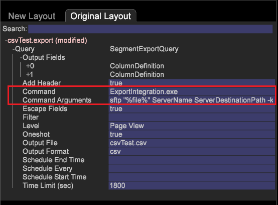

# Export a segment using S/FTP delivery{#export-a-segment-using-s-ftp-delivery}

You can now use CSV, TSV, Segment Export, and Segment Export with Header using FTP and SFTP protocols to export segment files from the client (workstation) to the server.

**Setting up S/FTP Export configuration files**

To set the export configuration, two new export configuration files were added to set up an FTP or SFTP connection, allowing the Server details to be picked from the *FTPServerInfo.cfg* file and the credentials will be picked from *FTPUserCredentials* folder (corresponding to the Server Name given in the command arguments).

* Set the **FTPServerInfo.cfg** file.

  Enter the FTP server information and set connection retries allowed from the workstation. Edit from the workstation or the server at [!DNL Server\Addresses\Export\]** [!DNL FTPServerInfo.cfg]** file. 

  ```
  FTP Servers = vector: 1 items 
    0 = ftpServerInfo:  
      Address = string:  
      Name = string:  
      Port = int: 21 
  Connect Retries = vector: 1 items 
    0 = connectServerRetries:  
      Retries = int: 0 
      Server Name = string:
  ```

* Set the **FTPUserCredentials.cfg** file.

  Enter user credentials to connect to servers using the [!DNL Server\Admin\Export\]** [!DNL FTPUserCredentials.cfg]** file. This file contains user credentials needed to connect to servers and can only be edited from server and not from workstation (client). 

  ```
  FTP User Credentials = vector: 1 items 
    0 = ftpUserCredInfo: 
      User Name = string:  
      User Password = EncryptedString:  
      Server Name = string:  
      Public Key Path = string:  
      Private Key Path = string:  
      Passphrase = EncryptedString:
  ```

  >[!NOTE]
  >
  >Ensure that SSH keys you generate for authentication are in the format identical to those that are generated when you use SSH Keygen command. 
  >
  >
  >Example for generating SSH keys using keygen: 
  >
  >
  >
  >
  >```  >
  >ssh-keygen -t rsa -b 4096 -C "<label>"
  >```  >
  >

  There are six parameters in the **FTPUserCredentials.cfg** file required for various FTP or SFTP transfers.

    1. *User Name* 
    1. *User Password* 
    1. *Server Name * 
    1. *Public Key Path * 
    1. *Private Key Path * 
    1. *Passphrase*

<table id="table_4EB416DC770D4D1AA4FAD9676C0D680C"> 
 <thead> 
  <tr> 
   <th colname="col1" class="entry"> Protocol </th> 
   <th colname="col2" class="entry"> Parameters </th> 
  </tr> 
 </thead>
 <tbody> 
  <tr> 
   <td colname="col1"> <p>FTP </p> </td> 
   <td colname="col2"> <p>Set parameters 1, 2, 3. </p> </td> 
  </tr> 
  <tr> 
   <td colname="col1"> <p>SFTP using password authentication </p> </td> 
   <td colname="col2"> <p>Set parameters 1, 2, 3 when transfer uses password authentication (-p in the command arguments). </p> </td> 
  </tr> 
  <tr> 
   <td colname="col1"> <p>SFTP using key authentication </p> </td> 
   <td colname="col2"> <p>Set parameters 1, 2, 3, 4, 5, 6 when transfer uses key authentication (-k in the command arguments). </p> </td> 
  </tr> 
 </tbody> 
</table>

**Setting the FTP and SFTP Export Commands**

1. Open an export table.

   From the Workstation, right-click a *Detail Table* and choose one of the export types—CSV , TSV, Segment Export, or Segment Export with Header. Or open the [!DNL .export] file from a command-prompt and edit (see [Configuring Segments for Export](../../../home/c-get-started/c-exp-data-seg-exp/t-config-sgts-expt.md#task-8857f221fa66463990ec9b60db6db372)). 

1. In the *Command* field, set it to point to the export executable: 

   ```
   ExportIntegration.exe
   ```

1. Set the *Command Arguments* fields as shown below for the protocol and authentication required:

   ** FTP**

   ```
   <i>Command Arguments</i> set to  
<i>ftp "%file%" ServerName ServerDestinationPath</i>
   ```

   

   **SFTP** (if using password for authentication)

   ```
   <i>Command Arguments</i> set to  
<i>sftp "%file%" ServerName ServerDestinationPath -p</i> 
   ```

   **SFTP** (if using keys for authentication)

   ```
   <i>Command Arguments</i> set to  
<i>sftp "%file%" ServerName ServerDestinationPath -k</i>
   ```

   

All Command Arguments are mandatory and need to be entered as shown.

## S/FTP export using private/public keys {#section-0534424d79a54a47b82594cfa7b3c17f}

To implement the FTP and SFTP Export using private and public keys, place the configuration files in these folders:

* Place **FTPServerInfo.cfg** in the [!DNL Server/Addresses/Export/] folder. 
* Place **FTPUserCredentials.cfg** in the [!DNL Server/Admin/Export/]folder.

Six parameters are included in the **FTPServerInfo.cfg** file:

1. *User Name* 
1. *User Password* 
1. *Server Name* 
1. *Public Key Path* 
1. *Private Key Path --* Place the private key path in the configuration file without the extension, for example:

[!DNL Private Key Path = string: E:\\Server\\campaign\\campaignprivatekey] 

1. *Passphrase*

FTP uses parameters 1,2, and 3.

SFTP uses parameters 1,2, and 3 when the transfer uses password authentication.

SFTP uses all six parameters when the transfer is done using key authentication. For example, if you are using keys for authentication:

[!DNL 'Command Arguments' = sftp "%file%" ServerName ServerDestinationPath -k]

The configuration files need to be in the correct location.

>[!NOTE]
>
>The public keys need to point to a **.pem** file and not to a folder location. You can create keys using an SSH key generation function from applications like Cygwin. (Putty generates keys in a .ppk format that is not supported.)

