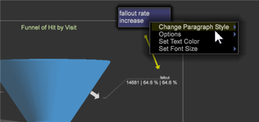

# Annotating visualizations{#annotating-visualizations}

The Presentation Layer lets you mark up and annotate your workspace visualizations and then publish with your call-outs and comments. Add text descriptions, graphic objects, callout arrows, color coding, images, and other features in an overlay to add annotations and clarify important data points, and then share with stakeholders.

**Add annotations to your visualizations:**

1. Open a workspace. 
1. Go to **File** > **Presentation Layer**. 
1. Click **Allow Presentation Layer**.

   Toggle the command in this menu to allow or disallow generating a presentation layer. A checkmark will appear when the presentation layer is allowed.

   

   When you allow the presentation layer, a clickable icon will appear in the right side of the toolbar.

    This clickable icon shows that you are in the **Hide Presentation Layer** mode but not able to see annotations. 

1. Click icon to toggle to **Show Presentation Layer**.

   View annotations in the presentation layer.

    This clickable icon shows that you are in the **Show Presentation Layer** mode but not able to edit.

   >[!NOTE]
   >
   >You can also right-click in the workspace to change modes using menu commands.

   

1. **Edit and add callout features.**

   Click icon again to capture a static representation of the workspace visualization and open an overlay to add or edit annotations.

    This clickable icon shows that you are in the **Edit Presentation Layer** mode to add and edit annotations.

   A gray overlay appears while in edit mode. 

1. **Add callout features**.

   Right-click the visualization to add a new text box. arrows, and other callout features to highlight and annotate for presentation.

   

1. **Set graphic features**.

   Select a graphic object and right-click to set options. You can set colors for a box or other graphic object, adjust text settings in a text box, and add arrows or set layering for lines.

   

1. **Add images to the workspace**.

   Right-click to add your .png and .jpg images to the overlay and resize. 

1. **Assign colors to graphic objects**.

   You can select objects in the presentation layer and assign colors using the color picker. 

1. **Export and share presentation layer**.

   After annotating your workspace visualizations, you can export the presentation layer with visualizations and share as a .png graphic file.

   Click **Export** > **Export PNG**.
