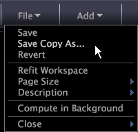

# Workspace File menu{#workspace-file-menu}

Information about the menu options available in the Workspace file menu.

In the workspace, click **[!UICONTROL File]**.

The following table provides descriptions of each menu item.

**Save**

Saves the workspace. See [Saving Workspaces](../../../home/c-get-started/c-work-worksp/c-save-wksp.md#concept-e0c34e75cc194e57bd02d1f02316a606).

**Save Copy As**

Saves the workspace with a different name or in a different location. See [Saving Workspaces](../../../home/c-get-started/c-work-worksp/c-save-wksp.md#concept-e0c34e75cc194e57bd02d1f02316a606).

**Revert**

Reverts to the last saved version of the current workspace.

**Refit Workspace**

Resizes visualizations to the display resolution you are using. This is helpful to quickly adjust your display for presentations.

**Page Size**

Sets a working page size for a workspace. You can select Full Screen, Standard, or any of the specific sizes for computer screens, printed pages, and reports. Full Screen fills your particular screen and Standard is a setting that can be configured to fit your organization’s standard screen size. The default Standard setting fills the screen when using 1024 x 768 resolution.

Workspaces that are copied, saved as [!DNL .png] files, or printed also use this page size for output. Page sizes larger than the Data Workbench visualization use scroll bars, while smaller sizes are centered on the screen and display a light gray border around the workspace.

**Description**

Enables you to create or edit a textual description of the workspace. This text appears on the [!DNL Worktop] below the thumbnail. See [Adding a Description to a Workspace](../../../home/c-get-started/c-work-worksp/t-add-wksp-desc.md#task-163734487e8848dfa0a4d8da6323a963).

**Compute in Background**

(Appears only when working online.) Keeps the queries in the selected workspace running in the background while you continue working. When selected, the thumbnail displays the following information, which indicates the progress of the queries:

* Working: *n%* - indicates that the query is processing and the percentage of the processing that is complete. 
* *n* MB Query Load - total size of the query result. Query Load is proportional to the total memory load of your Data Workbench server, but does not correlate directly. As a guideline, a 10 MB or higher query load may strain your system. The query load listed does not take clustering into account.

>[!NOTE]
>
>If Compute in Background remains selected, the queries in the selected workspace become standing queries, continuing to be updated and use memory load. Make sure to clear the selection for Compute in Background when you are finished working in the workspace.

**Close**

Closes the workspace. Click **[!UICONTROL Close]** > **[!UICONTROL Save]** to save the changes you have made in the workspace, or click **[!UICONTROL Close]** > **[!UICONTROL Don’t Save]** to return to the [!DNL Worktop] without saving the changes you have made in the workspace.

You also can save your changes, close the workspace, and return to the [!DNL Worktop] using any of the following methods:

* Click the Data Workbench logo in the upper-left corner of the workspace. 
* If your mouse has navigation buttons, click the back button on your mouse.

You also can void your changes by closing the workspace without saving by pressing **[!UICONTROL <Ctrl> + <Backspace>]** .

**Export to Excel from Template**

If Microsoft Excel is installed on the Data Workbench machine, automatically starts Microsoft Excel and exports the data from certain visualizations, certain legends, and text annotations to the template Excel file ( [!DNL .xls]or [!DNL .xlsx]) that you select. See [Exporting to a Template Excel File](../../../home/c-get-started/c-work-worksp/c-ex-wksp.md#section-814772929ca64cf6b92b89d3fdd02302). 
