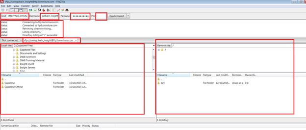

# Validation of Internal and External FTP Servers{#validation-of-internal-and-external-ftp-servers}

This is a quick guide giving you the minimum steps required to validate Internal and External FTP setup.

An Internal FTP is used when a consultant/architect internal to Adobe has to connect to the FTP site for file upload or download, whereas an External FTP is mainly for you as tthe user to upload the required data files.

For additional information on setting up FTP servers, see [File Transfer Protocol](https://docs.adobe.com/content/help/en/analytics/export/ftp-and-sftp/ftp-overview.html).

## Validation Steps - External FTP {#section-24428111b5c542ce81a765cd63424b97}

1. Open a Command Prompt. (Windows+R and type cmd) 
1. Type ftp `<ftp server>` 
1. Provide user name and password. 

1. Change local directory from where some file can be moved. Use this command:

[!DNL ftp> lcd C:\Users\andixit\Desktop]

   local directory now [!DNL C:\Users\andixit\Desktop]. 

1. Copy file from local to remote location. 

1. Logout from remote server. (Use below command)

[!DNL ftp> bye]

[!DNL 221 Goodbye] 

   >[!NOTE]
   >
   >Another way to validate FTP is using Filezilla. Provide Host Name, User Name, Password and Port. Right side of panel is remote site and left side is local site. To validate FTP drag and drop files from local to remote site and v.v.

   

## Validation Steps - Internal FTP {#section-b1f7a789ad6848cf9027f7953d81066e}

The above steps can be followed to validate internal ftp from any Adobe server. 
